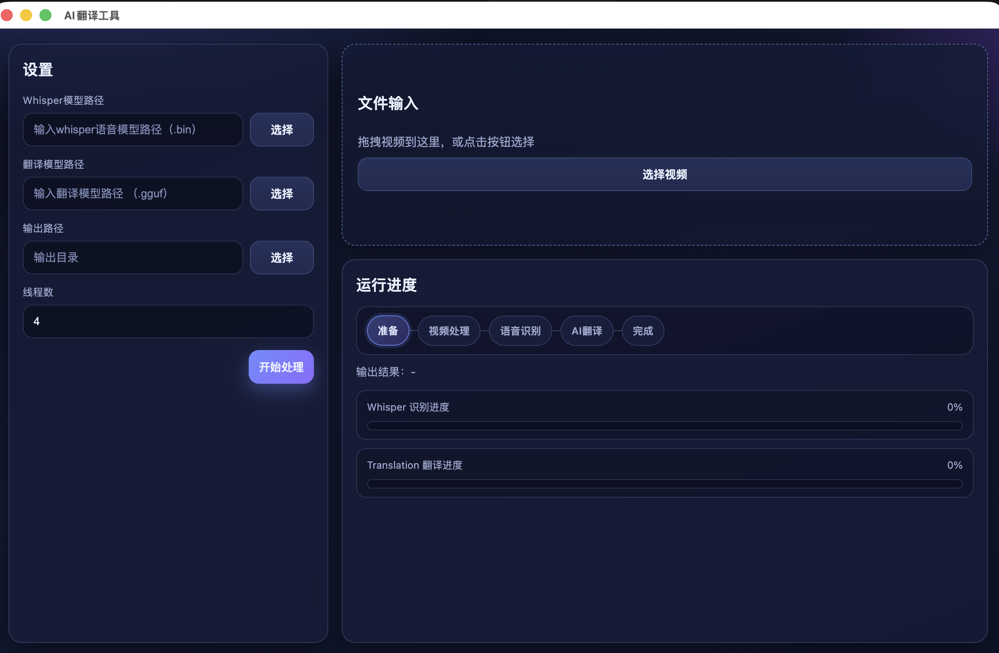

# AI Audio/Video Translation App

一个基于本地模型的音视频翻译工具：完成语音识别、翻译、字幕生成，并输出带字幕的视频文件。

## Features

- Local ASR (speech-to-text)
- Local translation
- Subtitle I/O: SRT input, SRT/ASS output
- Burn subtitles into video (ASS in MKV)
- Multi-thread processing
- Progress display and logging
- CLI mode and backend-service mode

---

## Environment Setup & Build

### 1) Prerequisites

- **ffmpeg llama.cpp whisper-cpp**

  mac
  ```bash
  brew install ffmpeg llama.cpp whisper-cpp 
  ```

  win
  ```powershell
  vcpkg.exe install ffmpeg:x64-windows llama-cpp whisper-cpp 
  ```

- Build tools (install based on your stack):
  - clang / gcc
  - cmake / make
- **Node.js (for Electron UI)**

  mac
  ```bash
  brew install node
  node -v
  npm -v
  ```

  win
  ```powershell
  ```

### 2) Project Structure (suggested)

```text
/models/    # model files (ggml / gguf)
/bin/       # built executables
/samples/   # sample input files
/output/    # generated subtitles/videos
config.json # default runtime config
```

### 3) Put Models

Example:

- `./models/ggml-large-v3.bin`
- `./models/HY-MT1.5-1.8B-GGUF.gguf`

### 4) Build (example)

mac
```bash
cd ${your project path}
mkdir -p build && cd build
cmake .. && make
```

win
```powershell
cmake -S . -B build -G "Visual Studio 18 2026" -A x64 -DCMAKE_TOOLCHAIN_FILE=C:/path/vcpkg/scripts/buildsystems/vcpkg.cmake -DVCPKG_TARGET_TRIPLET=x64-windows
cmake --build build --config Release
```

> If your repository uses other build tools, replace the commands accordingly.

---

## Configuration

Example `config.json`:

```json
{
  "audioModel": "./models/ggml-large-v3.bin",
  "translateModel": "./models/HY-MT1.5-1.8B-GGUF.gguf",
  "inputVideo": "./samples/input.mp4",
  "inputAudio": "./samples/input.wav",
  "inputSrt": "",
  "outputSrt": "./output/output.srt",
  "outputAss": "./output/output.ass",
  "threads": 4,
  "targetLang": "zh-CN",
  "silentLog": true
}
```

**model download:**

```
https://hf-mirror.com/ggerganov/whisper.cpp/blob/main/ggml-large-v3.bin
https://hf-mirror.com/tencent/HY-MT1.5-7B-GGUF/blob/main/HY-MT1.5-7B-Q8_0.gguf
```

## Electron Build & Run (UI)

### 1) Install dependencies

```bash
cd ${your project path}/electron
npm install
```

### 2) Run Electron in development mode

```bash
cd ${your project path}/electron
npm run dev
```

### 3) Build Electron desktop app

mac
```bash
cd ${your project path}/electron
npm run build:mac
```

win
```powershell
cd ${your project path}/electron
npm run build:win
```

### 6) Package installer (if configured)

```bash
cd ${your project path}/electron
npm run dist
```

生成物通常位于：

- `electron/dist/` (dmg/exe)

--- 
### Output artifacts

- `./output/output.srt`
- `./output/output.ass`
- `./output/output.mkv` (video with subtitles)


## How to Run

### CLI mode (example)

```bash
cd ${your project path}
./build/my_app \
  -v ./samples/input.mp4 \
  -w ./models/ggml-large-v3.bin \
  -m ./models/HY-MT1.5-1.8B-GGUF.gguf \
  -t 4 \
  -o ./output/
```

## Result Preview

### 1) Running ui



### 2) Subtitle Output (ASS)

```ass
[Script Info]
ScriptType: v4.00+
PlayResX: 1920
PlayResY: 1080

[V4+ Styles]
Format: Name, Fontname, Fontsize, PrimaryColour, SecondaryColour, OutlineColour, BackColour, Bold, Italic, Underline, StrikeOut, ScaleX, ScaleY, Spacing, Angle, BorderStyle, Outline, Shadow, Alignment, MarginL, MarginR, MarginV, Encoding
Style: Default,Arial,70,&H00FFFFFF,&H000000FF,&H00000000,&H64000000,0,0,0,0,100,100,0,0,1,3,2,2,29,29,32,1

[Events]
Format: Layer, Start, End, Style, Name, MarginL, MarginR, MarginV, Effect, Text
Dialogue: 0,0:00:00.03,0:00:03.69,Default,,0,0,0,,相反，我得到了大家的支持，也因此充满了能量。
Dialogue: 0,0:00:03.69,0:00:05.09,Default,,0,0,0,,有些回忆是被我们刻意改变的。
Dialogue: 0,0:00:05.09,0:00:06.61,Default,,0,0,0,,请尽情释放你的力量吧。
```

## TODO

- [✅] macOS support
- [ ] Windows support (TBD)


## Notes

- Model files are large and memory-intensive; ensure enough disk and RAM.
- If translation quality is unsatisfactory, switch/fine-tune the translation model.
- For multilingual UI, connect a separate frontend to this backend/CLI.

## Third-Party Libraries

This project uses the following third-party libraries:

| Library | Purpose | License | Link |
|---|---|---|---|
| whisper.cpp (Whisper) | Local speech-to-text (ASR) for audio/video | MIT | https://github.com/ggerganov/whisper.cpp |
| llama.cpp (Llama) | Local LLM inference for translation | MIT | https://github.com/ggerganov/llama.cpp |

### How They Are Used

- **whisper.cpp**: transcribes input audio/video into text segments.
- **llama.cpp**: translates recognized text into the target language.
- The generated text is then written to **SRT/ASS**, and can be muxed into MKV.

### License Notice

Both `whisper.cpp` and `llama.cpp` are licensed under the MIT License.  
Please keep their license texts in your distribution as required.
